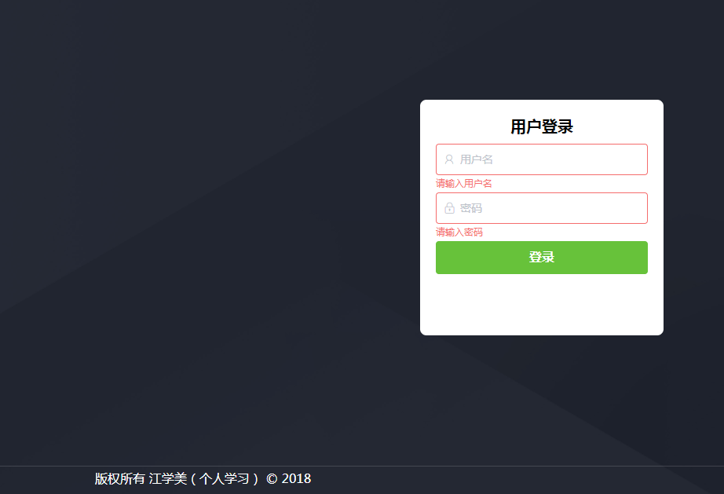
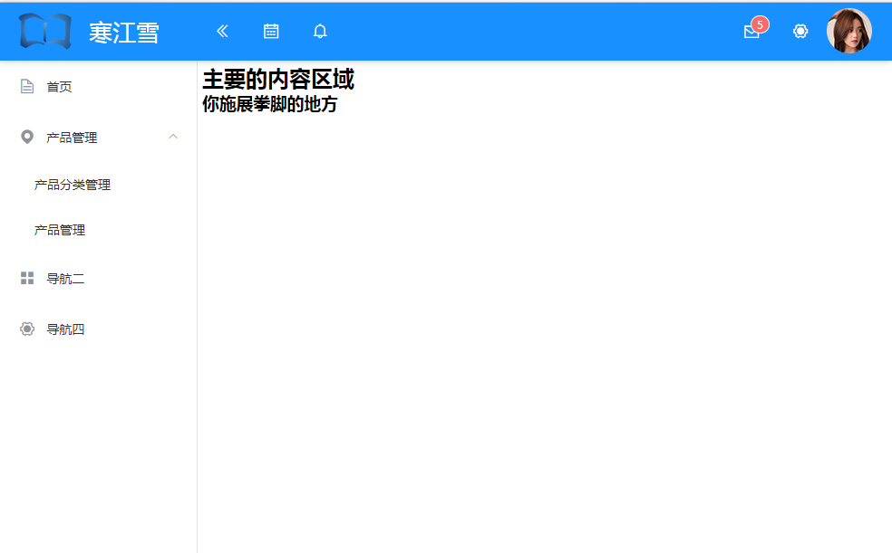
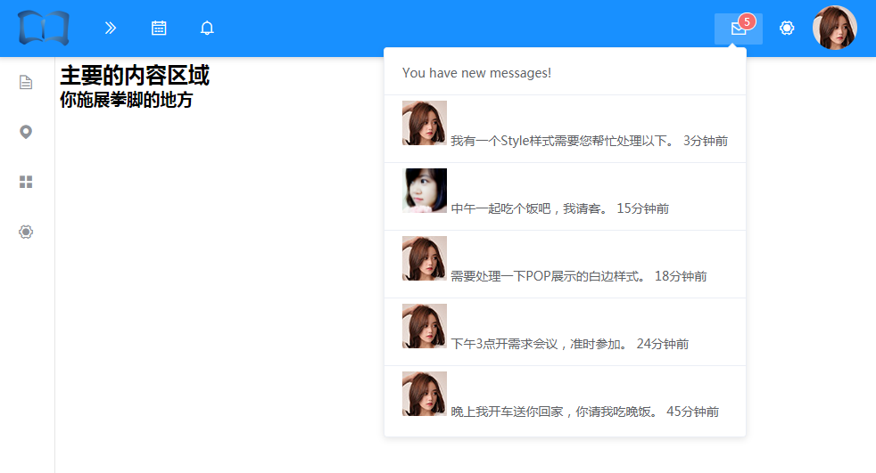
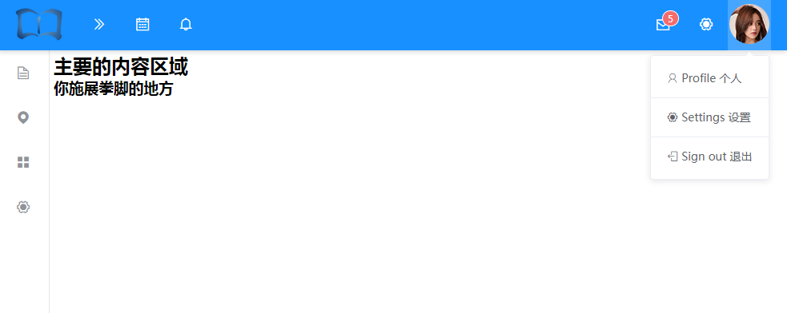

# admin-layout
一个纯html的vue element-ui的后台布局 （js引入方式）

## 下载 vue.js element-ui的js

[Vue.js官网下载(版本：2.5.17)](https://cn.vuejs.org/v2/guide/installation.html)  

+ github上下载的需要自己打包，我是直接从cdn上下的
[Element-ui下载(当前版本：2.4.9))](https://www.bootcdn.cn/element-ui/)
- 先下载 index.js
- 接着下载css,用编辑器打开css,查看里面引用的字体文件路径（其实就是同css文件同目录下 fonts/element-icons.woff ttf的字体类似），在地址栏中输入文字的路径下载
  如：https://cdnjs.cloudflare.com/ajax/libs/element-ui/2.4.9/theme-chalk/fonts/element-icons.woff
  字体文件一样存放在index.css同目录下的 fonts目录里面

## 下载axios.min.js同上，我在cdn上下 （0.19.0版本）

## 准备自己的 iconfont字体图标
[iconfont](http://iconfont.cn/)

## 编写html和样式

## 最终效果

